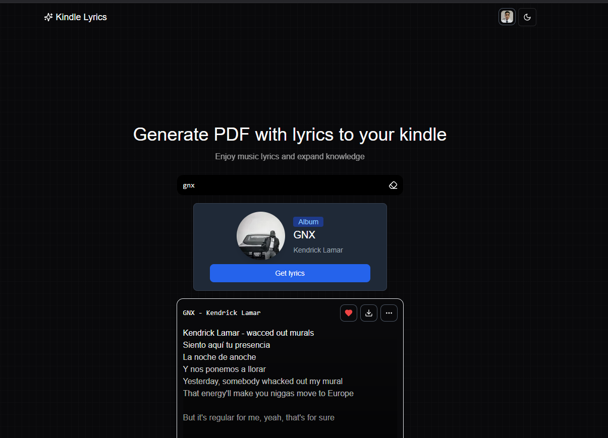
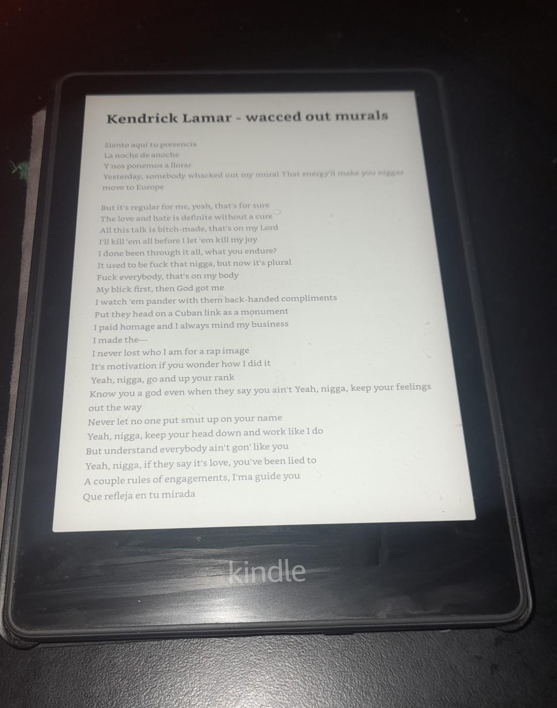

# Kindle Lyrics 🎵

**Kindle Lyrics** is a website that allows users to generate a PDF with full album lyrics and send it directly to their **Kindle email**.  
Expand your music knowledge and enjoy reading lyrics on your Kindle like never before! 📖✨

---

## 🚀 Features

- 🔍 **Smart search**: search for albums with real-time suggestions.
- 📑 **PDF generation**: create a single PDF with all the lyrics from an album.
- 📤 **Send to Kindle**: automatically deliver the generated PDF to your Kindle email.
- 🌍 Future plans: add translations, Spotify integration, user preferences, and more!

---

## 📦 Installation

Clone the repository and install the dependencies:

```bash
git clone https://github.com/brandonporcel/kindle-lyrics.git
cd kindle-lyrics
npm install
npm run dev
```

## 🔑 Setup: Getting your Klerk API Keys

This project uses Klerk to send emails to Kindle.
Follow these steps to obtain and configure your keys:

1. Go to [Klerk Dashboard](https://dashboard.clerk.com/) and create a free account.
2. Create a new project inside Klerk.
3. In the project settings, you’ll find your **API Key** and **Secret**.
4. Copy them into a .env file in the root of your project:
   `bash
KLERK_API_KEY=your_api_key_here
KLERK_API_SECRET=your_api_secret_here
`
5. Restart your development server:
   `bash
npm run dev
`

## ✅ To-Do List

- [x] Add 2th method to get lyrics (https://www.lyricsfreak.com/search.php?q=Smooth+Operator)
- [ ] Add 3th method to get lyrics. [(genius-scrapper)](https://github.com/brandonporcel/genius-scrapper)
  - [x] Docker
  - [ ] Add anotations to the lyrics
  - [ ] Search another hosting to make fast scrappings. Now it is in render
- [ ] Implement deepl for translations
- [ ] Handle pdf download
- [ ] Add tests
- [ ] Allow users to log in with Spotify and display their liked albums for easy selection and lyric generation.
- [ ] Add a search filter with the ability to:
  - Search only songs and not albums.
    - After successfully sending the e-mail, suggest the album associated with the selected song.
- [ ] Create database to save users and their preferences (liked albums, historial, save kindle mails)

## 🤝 Contributions

Contributions are welcome!
If you have ideas or improvements, feel free to fork the project and submit a pull request (PR).

## 💬 Feedback

I’d love to hear your thoughts and suggestions!
Reach out to me via:

- 📧 [Email](mailto:brandon7.7porcel@gmail.com)
- 🌐 [LinkedIn](https://linkedin.com/in/brandonporcel)


