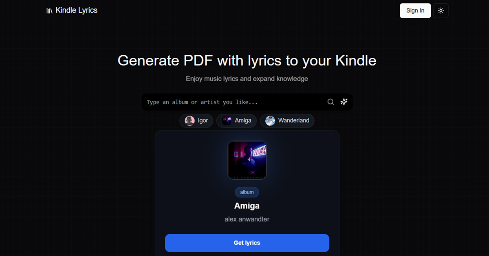

# Kindle Lyrics 🎵

A web application that generates EPUBs with complete album lyrics and sends them directly to your **Kindle** device.

> Transform your favorite albums into readable e-books optimized for Kindle with proper formatting, cover art, and table of contents.

---

## ✨ Features

- 🔍 **Smart Album Search** - Real-time suggestions powered by Spotify API
- 📚 **EPUB Generation** - Creates properly formatted e-books with:
  - Album cover as book cover
  - Metadata (artist, album name, release date)
  - Table of contents for easy navigation
  - Each song on a separate chapter
- 📧 **Direct Kindle Delivery** - Automatically sends the EPUB to your Kindle email
- 💾 **Local Download** - Option to download the PDF file directly
- 🎯 **Multiple Lyrics Sources** - Fetches lyrics from multiple APIs for better coverage

---

## 🚀 Quick Start

### Installation

```bash
   git clone https://github.com/brandonporcel/kindle-lyrics.git
   cd kindle-lyrics
   npm install
   npm run dev
```

## 🔑 Setting Up API Keys

### Spotify API

1. Go to [Spotify Developer Dashboard](https://developer.spotify.com/dashboard)
2. Create a new app
3. Copy your **Client ID** and **Client Secret**
4. Add them to your `.env.local` file

### Email Configuration (Gmail)

1. Enable 2-factor authentication on your Google account
2. Generate an [App Password](https://myaccount.google.com/apppasswords)
3. Use this password in your `.env.local` file

### PDFShift (Optional)

1. Sign up at [PDFShift.io](https://pdfshift.io/)
2. Get your API key from the dashboard
3. Add it to your `.env.local` file

---

## 📖 How to Use

1. **Search for an album** using the artist or album name
2. **Select the desired album** from the suggestions
3. **Choose your action**:
   - 📧 Send to Kindle email
   - 💾 Download EPUB locally
4. **Enjoy reading** on your Kindle or e-reader!

---

## 🛠️ Tech Stack

- Next.js - TypeScript - Shadcn - Spotify API - nodepub

---

## 🗺️ TODO

### High Priority

- [ ] **Genius Integration** - Add [genius-scrapper](https://github.com/brandonporcel/genius-scrapper) as 3rd lyrics source
  - [x] Docker setup
  - [ ] Include annotations in lyrics
  - [ ] Improve hosting for faster scraping (currently on Render)
- [ ] **Translation Support** - Integrate DeepL for multi-language lyrics
- [ ] **User Authentication** - Spotify login to access liked albums
- [ ] **Database Integration** - Save user preferences, history, and Kindle emails

### Future Enhancements

- [ ] Unit and integration tests
- [ ] Song-only search (not just albums)
- [ ] Saved Kindle email addresses
- [ ] Download history tracking
- [ ] Favorites system

---

## 🤝 Contributing

Contributions are welcome!
If you have ideas or improvements, feel free to fork the project and submit a pull request (PR).

## 💬 Feedback

I’d love to hear your thoughts and suggestions!
Reach out to me via:

- 📧 [Email](mailto:brandon7.7porcel@gmail.com)
- 🌐 [LinkedIn](https://linkedin.com/in/brandonporcel)

---


